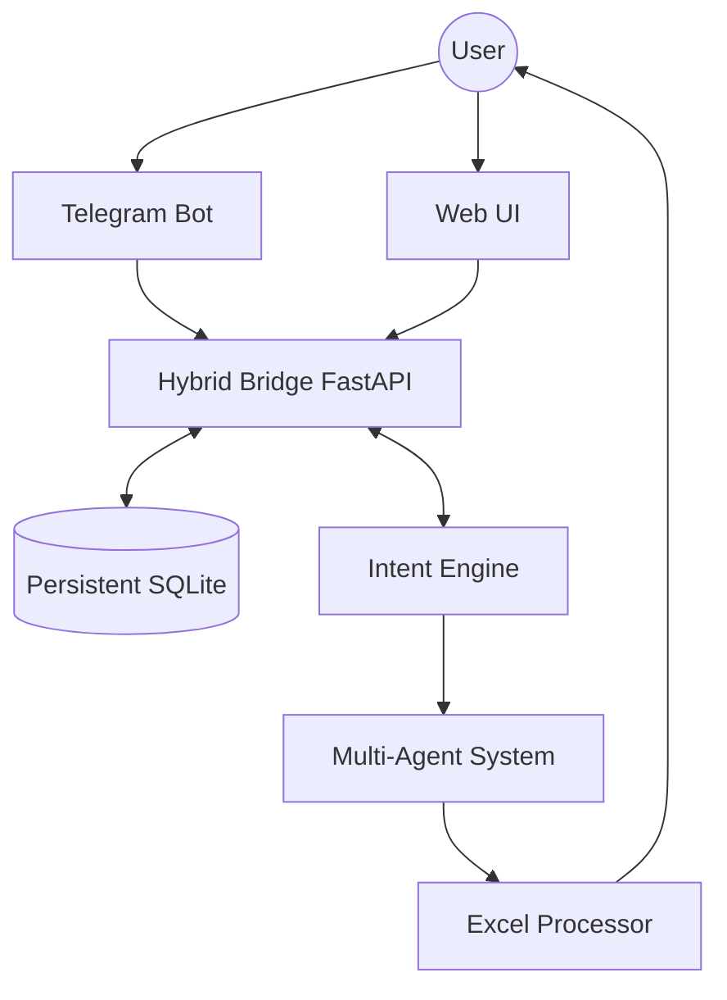

# MLJ Results Compiler: Design Mechanics

This document provides a clean, visual walkthrough of how the system works. It is intended for developers and maintainers to understand the core mechanics and architecture.

## 🏗️ System Overview

The system is built as an intelligent orchestrator that bridges human input (Telegram/Web) with automated data processing (Excel).

## 🛠️ Core Components

### 1. Hybrid Bridge (`src/hybrid_bridge.py`)
The central nervous system of the application. It provides a unified FastAPI layer that handles:
- **Telegram Webhooks**: Processes incoming bot messages.
- **Web API**: Powers the browser-based upload and consolidation interface.
- **Orchestration**: Directs traffic between the data layer and AI services.

### 2. Persistent Data Layer (`src/session_storage.py`)
Unlike early versions that used in-memory storage, the system now uses a **SQLite-backed persistence layer**.
- **Session Stability**: User uploads and results survive server restarts.
- **Workflow State**: Tracks the progress of consolidation sessions across different interfaces.
- **Security**: Implements path-traversal protection for all file operations.

### 3. Multi-Agent AI System (`src/ai_assistant.py`)
A sophisticated layer that adds conversational intelligence:
- **Intent Engine**: Parses natural language (e.g., "I want to merge files") into actionable system commands.
- **Document Agents**: Specialized logic for handling different document types (Tests, OCR, etc.).
- **Data Transformation**: Allows users to "ask" for data changes (e.g., "Add a pass/fail column") instead of manual editing.

### 4. Excel Processor (`src/excel_processor.py`)
The "heavy lifter" for data consolidation:
- **Fuzzy Matching**: Matches participants across different test files via email.
- **Calculations**: Native support for Grade 6 participation bonuses and automated grading.
- **Standardization**: Ensures uniform column structure and aesthetic styling in output files.

## 🚀 Key Workflows

### Consolidation Workflow
1. **Upload**: Files are received via API/Bot and stored in `temp_uploads/{session_id}`.
2. **Analysis**: The system identifies the "Base Test" (usually Test 1) to build the participant roster.
3. **Merging**: Scores from other tests are joined to the roster based on email.
4. **Exporting**: A final, styled `.xlsx` is generated and recorded in the database for download.

---
*For deployment details, see [DEPLOYMENT.md](DEPLOYMENT.md). For security protocols, see [SECURITY.md](SECURITY.md).*
